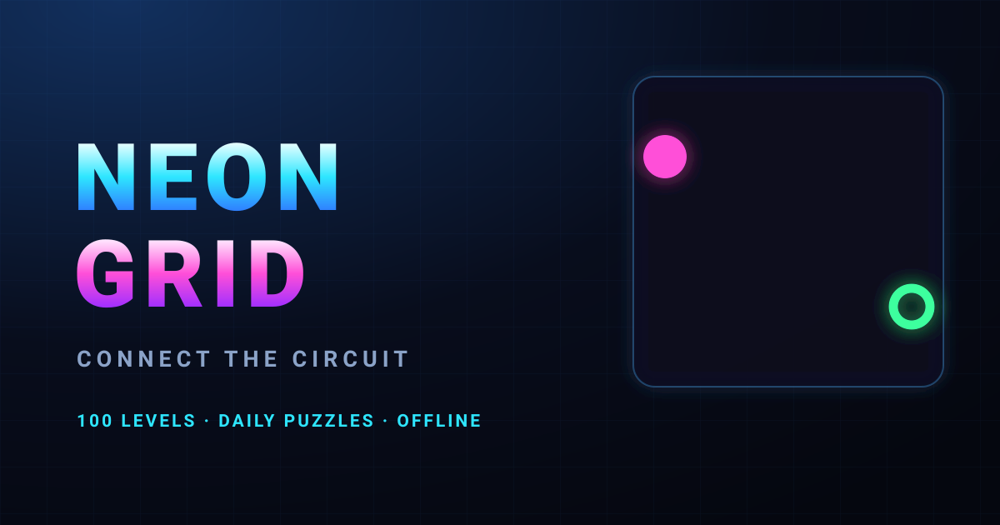

# ⚡ NEON GRID

**A neon circuit-connection puzzle game. 100 levels. Daily puzzles. Offline. Mobile-first.**

[](https://sakibsheikho69252-nitizen.github.io/neon-grid/)
[](LICENSE)
[](#)



## 🎮 What is it?

Rotate circuit tiles to route energy from the **source** to every **receiver**.
Tap a tile → it rotates 90°. Connect the whole grid to win.

Built from scratch with **zero dependencies** — no npm, no CDN, no build step,
no backend. One HTML file. Works offline. Runs on any modern browser.

## ✨ Features

- 🧩 **100 handcrafted + procedural levels** across 5 worlds
- 📅 **Daily Puzzle** — same seed for everyone, every day
- ⭐ **3-star scoring** based on moves, time and hint usage
- 🔌 Real **graph connectivity** — energy actually flows through tiles
- 🌀 Special tiles: sources, receivers, locked, one-way, portals, empty cells
- ↩️ **Undo / Reset / Hint** with real solution detection
- 💾 **localStorage save** — progress, stars, best times, achievements
- 🏆 **20 achievements**
- 🔊 **Web Audio API** sound — no audio files, generated in real time
- 📳 **Vibration** on supported devices
- ✨ Canvas particle effects with reduced-motion option
- 📱 Mobile-first, portrait + landscape, safe-area aware
- ♿ Keyboard support, high contrast, visible focus states

## 🕹️ How to Play

1. Tap any tile to rotate it 90° clockwise.
2. Power flows only when two touching edges both have an open line.
3. Light up every green **receiver** to complete the circuit.
4. Fewer moves + less time = more stars.

### Keyboard (desktop)

| Key | Action |
|-----|--------|
| `Click` | Rotate tile |
| `Z` / `U` | Undo |
| `R` | Reset level |
| `H` | Hint |
| `Esc` | Pause |

## 🚀 Run Locally

```bash
git clone https://github.com/sakibsheikho69252-nitizen/neon-grid.git
cd neon-grid
# just open index.html — that's
